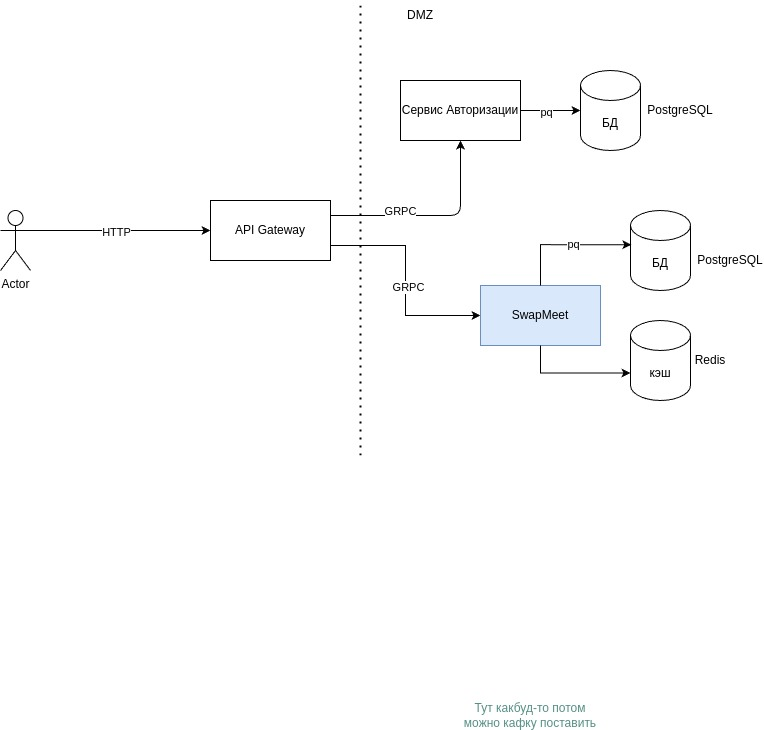
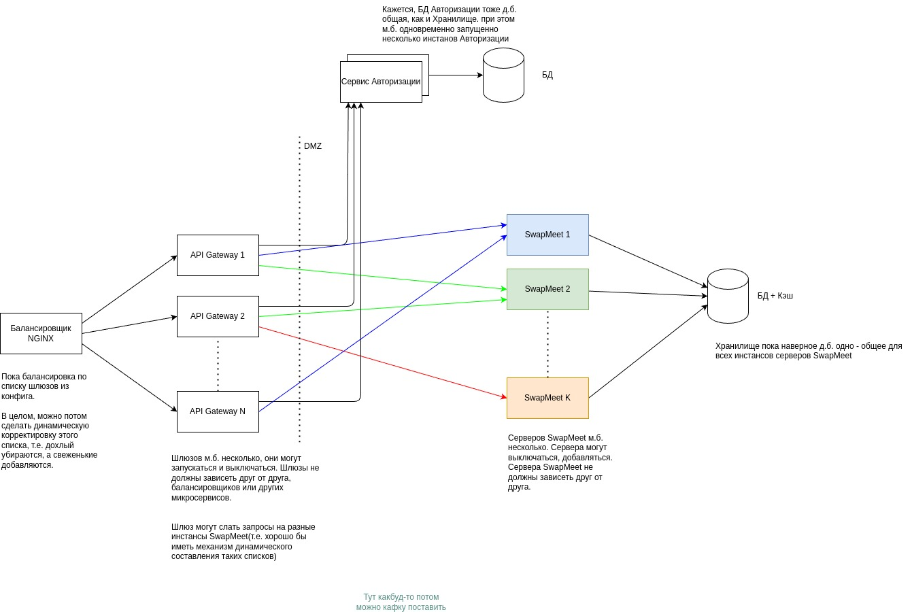

# SwapMeet - доска объявлений.

*Сервис является более детальной проработкой моего pet-проекта: https://github.com/idalgo-2021/ya_lms_swapmeet, выполненного в рамках проектного этапа обучающего курса и ограниченного времени. Это своего рода работа над ошибками.*

## Описание изменений

* Во всех компонентах (микросервисах) изменена работа с логером (теперь он создается на уровне конструктора соответствующего модуля), упрощены запросы к БД, частично отрефакторен код, устранены найденные ошибки.
* Добавлен функционал отправки объявлений на модерацию и собственно функционал модерации. 
* При изменении пользователем объявления, оно (вне зависимости от текущего статуса) переводится в черновики.
* Упрощен и расширен контракт взаимодействия с Swapmeet-сервером (теперь токены доступа передаются в метаданных запросов).
* Обновлена и расширена документация Swagger(на шлюзе).

## Краткое описание

### Сервис предусматривает три авторизованных роли пользователей
*    `user` - 'Обычный пользователь' (пока при регистрации все создаются с такой ролью - в БД значение по умолчанию)
*    `moderator` - 'Модератор контента'
*    `admin` - 'Администратор системы'

### Сервис предусматривает три статуса объявлений
* `draft` - Черновик(новое, возвращенное с модерации, снятое с публикации)
* `moderation` На модерации
* `published` - Опубликовано

### Описание функциональности
* Неавторизованные пользователи
    - Получение списка всех опубликованных объявлений (с фильтрацией по категориям)
    - Получение опубликованного объявления по его идентификатору
    - Получение списка категорий объявлений
   
* Обычный пользователь(авторизованный)
    - Получение списка всех опубликованных объявлений (с фильтрацией по категориям)
    - Получение опубликованного объявления по его идентификатору
    - Получение списка категорий объявлений
    - Создание нового объявления
    - Редактирование собственных объявлений
    - Получение списка всех своих объявлений
    - Отправка объявления на модерацию(для публикации) 

* Модератор и администратор (авторизованные пользователи с доступными ролями Модератор и Администратор)
    - Получение списка всех опубликованных объявлений (с фильтрацией по категориям)
    - Получение опубликованного объявления по его идентификатору
    - Получение списка категорий объявлений
    - Создание нового объявления
    - Редактирование собственных объявлений
    - Получение списка всех своих объявлений
    - Отправка объявления на модерацию(для публикации) 
    - Создание новых категорий
    - Получение списка всех объявлений (с фильтрацией по статусам и категориям)
    - Публикация объявления
    - Возврат объявления в черновики

---

Проект реализует сервис доски объявлений и состоит из трёх микросервисов, взаимодействие с которыми реализовано по протоколу gRPC, контракты которых находятся в папках `proto` (каждого из сервисов). 
: 

## 1.  Сервис авторизации 

Предоставляет функционал авторизации пользователей на основе JWT-токенов(использует отдельную БД PostgreSQL). 

* [Каталог **Auth-service**](auth_service)
* [Описание сервиса **Auth-service** ](auth_service/Readme.md)


## 2. Шлюз(API Gateway) 

Предоставляет HTTP API потребителям и обеспечивает маршрутизацию пользовательских запросов между сервисами.

* [Каталог **API Gateway**](api_gateway)
* [Описание сервиса **API Gateway**](api_gateway/Readme.md)

 *Обратите внимание, сервис **API Gateway** имеет описание HTTP API в формате Swagger*

## 3. Сервер Swapmeet

Реализует базовую логику работы с оъявлениями(использует отдельные БД PostgreSQL и Redis).

* [Каталог **Swapmeet**](app_server)
* [Описание сервиса **Swapmeet**](app_server/Readme.md)

---


## Архитектура SwapMeet


* Архитектурный скетч реализованного сервиса(прототипа):




* Архитектурный скетч целевого сервиса:




## Подготовка и запуск проекта
* Скачайте локально репозиторий проекта(сервиса)
```
git clone https://gitlab.crja72.ru/gospec/go12/swapmeet.git
```

* Установите локально Golang(последней версии)
* Установите локально Docker

### Покомпонентный запуск
* В каталоге каждого из компонентов(микросервисов) нужно выполнить команды:
    * Установка зависимостей: 
    ```
    go mod tidy
    ``` 
    * Сборка контейнеров с БД: 
    ```
    sudo docker compose up --build
    ```
    * Запуск сикросервиса: 
    ```
    go run main.go
    ```